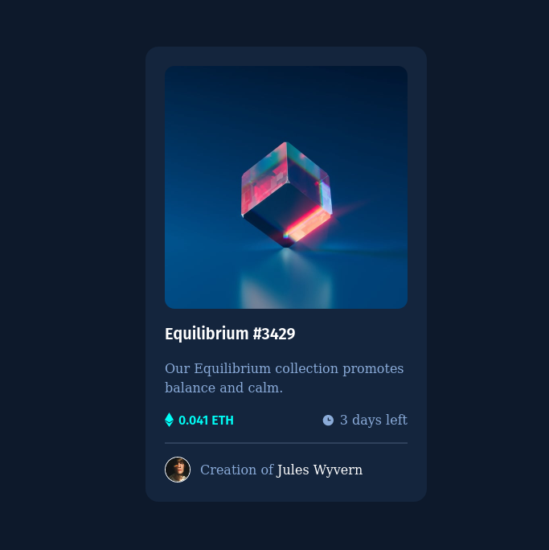

# Frontend Mentor - NFT preview card component solution

This is a solution to the [NFT preview card component challenge on Frontend Mentor](https://www.frontendmentor.io/challenges/nft-preview-card-component-SbdUL_w0U). Frontend Mentor challenges help you improve your coding skills by building realistic projects. 

## Table of contents

- [Overview](#overview)
  - [The challenge](#the-challenge)
  - [Screenshot](#screenshot)
  - [Links](#links)
- [My process](#my-process)
  - [Built with](#built-with)
  - [What I learned](#what-i-learned)
  - [Continued development](#continued-development)
  - [Useful resources](#useful-resources)
- [Author](#author)
- [Acknowledgments](#acknowledgments)

## Overview

### The challenge

Users should be able to:

- View the optimal layout depending on their device's screen size
- See hover states for interactive elements

### Screenshot



### Links

- Solution URL: [Add solution URL here](https://your-solution-url.com)
- Live Site URL: [Add live site URL here](https://your-live-site-url.com)

## My process

### Built with

- Semantic HTML5 markup
- CSS custom properties
- Flexbox
- CSS Grid
- [Tailwind CSS](https://tailwindcss.com/) - Tailwind CSS framework

### What I learned

I learned how to use tailwind's group hover to toggle element's display mode.

```html
<div class="group absolute w-full h-full flex justify-center items-center cursor-pointer">
    <div class="absolute rounded-xl w-full h-full opacity-50 bg-cyan-custom hidden group-hover:block"></div>
    
</div>
```

### Continued development

### Useful resources

- [Add custom google font to tailwindcss](https://javascript.plainenglish.io/how-to-add-a-custom-google-font-to-a-next-js-and-tailwind-css-app-d0e4ad03f1c3) - This article helps to add google font to Tailwind CSS configuration.
- [Group Hover](https://dev.to/mtownsend5512/revealing-hidden-elements-when-hovering-a-parent-with-tailwind-css-159a) - This article helps me how to change display mode when hover parrent element.

## Author

- Frontend Mentor - [@trinhlehainam](https://www.frontendmentor.io/profile/trinhlehainam)
- Twitter - [@namtrile](https://www.twitter.com/namtrile)

## Acknowledgments
